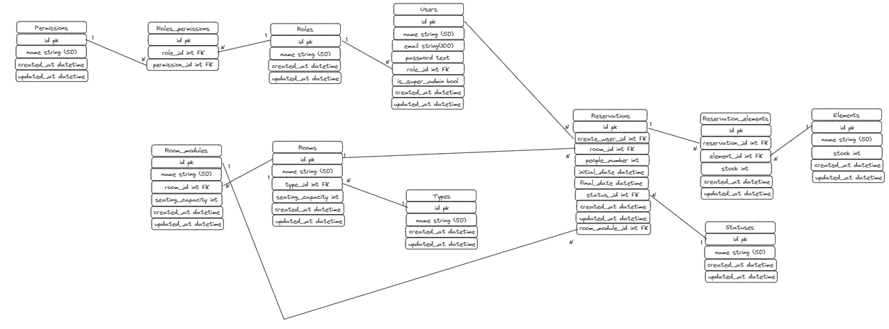

# Pasos para la instalacion de la aplicacion

**NOTA:** Para el correcto funcionamiento de la aplicacion, se requiere tener PHP 8.1+ y NodeJs 16+. Adicionalmente se requiere instalar el gestor de paquetes de PHP, Composer. Y por ultimo, se necesita de una instancia de base de datos MySQL

## Clonar el repositorio

1.  Abre una terminal y accede a un directorio donde deseas clonar el proyecto, por ejemplo: `cd ~/Documents/`
2. Ejecutar el comando git clone -b master https://github.com/andresfmaldonado/cooReservation.git
3. Ubicarse en la carpeta recien creada: `cd  cooReservation`

## Instalación de dependencias

Para instalar las dependencias se debe ejecutar 2 comandos:

1. `composer install`
2. `npm install`

## Ejecución de migraciones

Para poder ejecutar las migraciones, primero se debe crear la base de datos `cooreservation`. Adicionalmente configurar la conexion en el `.env`

Posterior a lo anterior, se debe ejecutar el comando `php artisan migrate`

## Ejecucion de seeders

Para ejecutar los seeders y configurar la informacion base, se requiere ejecutar el comando `php artisan db:seed`

## Ejecución de la aplicación

Para ejecutar la aplicacion, se debe abrir 2 consolas. 

En la primera ejecutar el comando `npm run dev` para habilitar el frontend. En la segunda consola ejecutar el comando `php artisan serve` para levantar el servicion de laravel.

### NOTAS SOBRE EL DISEÑO Y CONSTRUCCION

Esta aplicación está construida con el lenguaje PHP, utilizando el framework Laravel en su versión 10.

Se utilizaron las rutas web y el gestor de sesiones propio del framework para validar y gestionar la sesion del usuario, en conjunto con el paquete `Fortify` de laravel.

Finalmente, para la construccion de las vistas, se utilizó el plugin `Breeze` con el motor de plantillas `Blade`. Como framework de estilos se utilizó `Tailwind CSS`, el cual está inmerso con el plugin.
 
Adicionalmente, se implementó la libreria `Datatables` para la construccion e interaccion con las tablas utilizadas.

## Modelo Entidad Relacion

